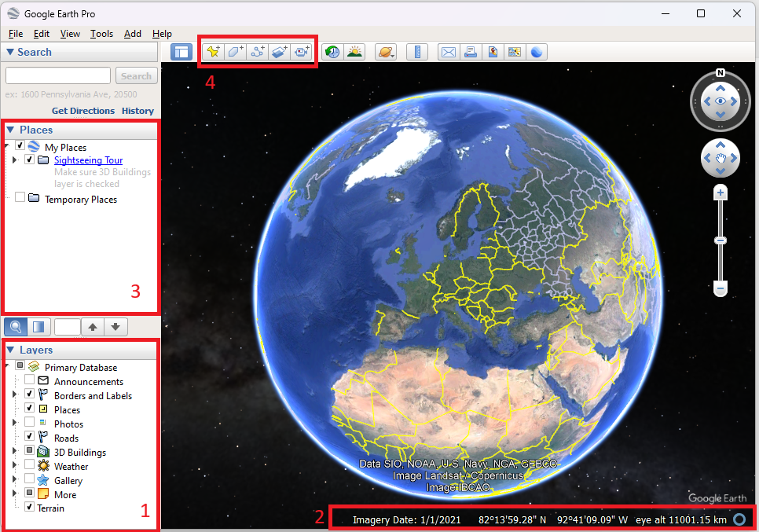
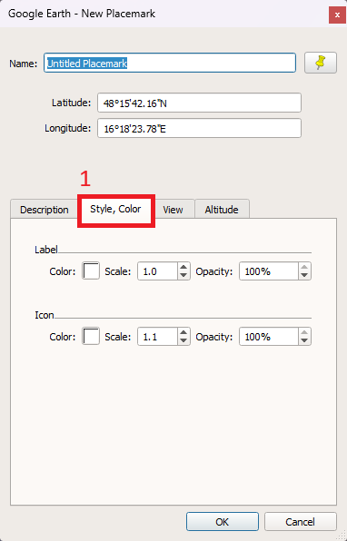

### Fernerkundung in der Landschaftsplanung - Tag 1 - Google Earth Pro

**Autoren:** Diese Übung wurde von **Dr. Anika Sieber**, FU Berlin entwickelt. Für die Verwendung an der BOKU wurden von Fabian Fassnacht kleinere Anpassungen durchgeführt. 

## 1 Bildinterpretation mit Google Earth Pro

### Allgemeine Hinweise

• Lesen Sie sich dieses Handout ausführlich bis zum Ende durch, **bevor Sie mit der Übung beginnen**! Sehr häufig klären sich Ihre aufkommenden Fragen in den nächsten Arbeitsschritten!

•Legen Sie sich einen Arbeitsordner an, in dem Sie alle zukünftigen Daten für unseren Fernerkundungskurs speichern. Wir empfehlen, diesen Ordner z.B.  **FE_Kurs** zu nennen und in diesem weitere Unterordner für jede einzelne Sitzung anzulegen (z.B. **…\FE_Kurs\01_GoogleEarth** für die heutige Sitzung).

Wichtig für alle Sitzungen: Bitte achten Sie auf die korrekte Benennung Ihrer Ordnernamen:

 - Erlaubt sind: Zahlen, gängige Buchstaben sowie Unterstriche.
 - Verzichten Sie unbedingt auf: Umlaute, Leerzeichen und Sonderzeichen!

### Lernziele
• Kennenlernen der Google Earth Pro-Benutzeroberfläche
• Satellitenbilder zeitlich einordnen können
• Geoobjekte in Satellitenbildern erkennen
• Digitalisieren in Google Earth Pro

## Zeitliche und räumliche Orientierung in Google Earth Pro
• Starten Sie Google Earth Pro* und machen Sie sich mit der Oberfläche vertraut. (* Verwenden Sie bitte die App/das Programm! Die webbasierte Version ist weniger umfangreich!)

• Nutzen Sie die Tipps zum Programmstart um zu erlernen wie Sie in Google Earth navigieren können (sowohl räumlich als auch zeitlich).

• Nutzen Sie alternativ zum Zoombalken das Mausrad um näher an die Erdoberfläche zu zoomen.

• Deaktivieren Sie unter **Layers** alle Ebenen (im Fenster auf der linken Seite alle Häkchen entfernen) und schalten Sie nun nach und nach Ebenen hinzu, um diese besser kennenzulernen (Siehe Markierung 1, Abbildung 1).

**WICHTIG:**

• KOORDINATEN: Google Earth verwendet in der Voreinstellung geographische Koordinaten mit WGS84 als Ellipsoid. → In der Google Earth Menüleiste unter Tools > Optionen > 3D-Ansicht lässt sich die Anzeige von geographischen Koordinaten auf das UTM Koordinatensystem („Universales transversales Mercator
-Koordinatensystem“) umstellen.

• NEIGUNG: Beim Zoomen wird die Ansicht automatisch geneigt. Dies können Sie ausstellen unter Tools > Optionen > Navigation: „Beim Zoomen nicht automatisch neigen“.

**Aufgabe:**

• Betrachten Sie mehrere Gebiete Ihrer Wahl in Wien und Umgebung, um nur anhand der Bilder folgende Fragen zu beantworten:

1)Zu welcher Jahreszeit wurde die jeweilige Bildaufnahme gemacht? Woran können die einzelnen Jahreszeiten generell erkannt werden?

2) Können Sie Monat und Jahr feststellen?

• Navigieren Sie zur Türkenschanze und suchen Sie die Mensa 
3) Woran haben Sie die Mensa erkannt?
4) Wie beurteilen Sie die Qualität der Bilddaten?

➔ Notieren Sie sich Ihre Antworten, wir besprechen diese im Seminar.

Tipp: In der Google Earth-Statusleiste rechts unten sind Informationen über die verwendeten Bilddaten (Aufnahmedatum, Koordinaten, die Höhe über NN und die Sichthöhe) (Siehe Markierung 2, Abbildung 1).

## Digitalisieren in Google Earth Pro

In Google Earth können Geodaten selbst erstellt und in einem Datenformat gespeichert werden, welches anschließend in ein Geographisches Informationssystem (GIS, z.B. ArcGIS oder QGIS) importiert werden kann.

• Links unter „My Places (Meine Orte)“ können Sie selbsterstellte Punkte, Polygone und Linien speichern. (Siehe Markierung 3, Abbildung 1).

• Fügen Sie unter My Places (Meine Orte) > Rechtsklick > Hinzufügen einen neuen Ordner in My Places (Meine Orte) hinzu und erstellen Sie die folgenden Digitalisierungen in diesem Ordner.

• Nutzen Sie die Werkzeugleiste  (Siehe Markierung 4, Abbildung 1). um…

 - die S-Bahn (einen individuellen Abschnitt) als Linie zu
   digitalisieren.
 -  die Fläche des Türkenschanzparjes als Polygon zu
   digitalisieren (ENTWEDER als Umrandung mit halb transparenter Füllung
   ODER nur Umrandung ohne Füllung).
  - die BOKU Gebäude auf der Türkenschanze zu markieren (vergeben Sie als Namen die Gebäudenamen, wählen Sie die Symbole z.B. entsprechend der Fachbereiche bzw. Nutzung aus).

• Symbole und Farben können in dem sich öffnenden Fenster angepasst werden (Markierung 1, Abbildung 2)

WICHTIG: Punkte, Polygone und Linien können nur bearbeitet und auch ergänzt werden, solange dieses Fenster geöffnet ist!

• Speichern Sie nach der Digitalisierung Ihren Ordner (Rechtsklick > Ort speichern unter…) in einer kmz-Datei (Keyhole Markup Language, Dateiendungen: .kmz, .kml) in Ihrem persönlichen FE-Ordner (z.B. …\FE_Kurs\01_GoogleEarth).

• Schließen Sie Google Earth.

• Starten Sie das Programm erneut. Rekonstruieren Sie Ihre digitalisierten Geoobjekte über die kmz-Datei. Die kmz-Datei kann über Datei > Öffnen wieder in Google Earth importiert werden.

## Daten in QGIS öffnen

• Öffnen Sie QGIS und importieren Sie dort die gerade erstellte kmz-Datei.

• Wählen Sie in der oberen Menüleiste > Layer > Add Layer > Add Vector Layer

• Im sich öffnenden Fenster des Data Source Manager | Vector > Vector klicken Sie auf den Browse-Button . Navigieren Sie hier zu Ihrem Ordner und laden Sie Ihre erstellte kmz-Datei.

• Exportieren Sie nun die Layer-Dateien (jeweils Points, Polygons und Polylines) als Shapefiles (Rechtsklick > Export > Save Features As… > „ESRI Shapefile“) und speichern Sie diese Dateien in Ihrem FE-Ordner.

• Beachten Sie die Projektion der neuen Datensätze. Was müssen Sie tun, um diese ggf. zu ändern?

Das waren die Inhalte der ersten Sitzung „Bildinterpretation mit Google Earth“.
Wenn Sie dieses Handout durchgearbeitet haben, haben Sie

✓ sich damit beschäftigt, wie man Satellitenbilder zeitlich und räumlich einordnen kann und

✓ gelernt, Geodaten in Google Earth für Ihr eigenes Projekt zu nutzen.
